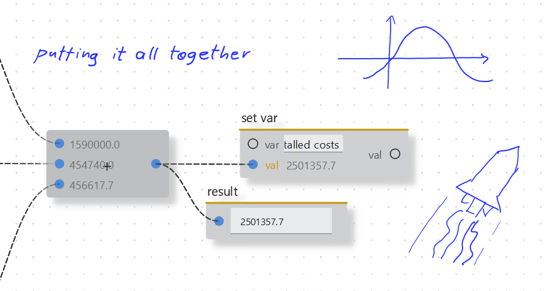

*Be aware that all the all new Ryven 3, and particularly the new underlying framework, haven't been tested extensively yet, so there might be some further changes incoming.*

<p align="center">
  
</p>

# A simple flow-based visual scripting env for Python

## Intro

Hello there! Ryven is an editor combining flow-based visual scripting with Python. It provides an easy to use system for programming nodes executing any Python code.

## Installation

```
pip install ryven
```

or from sources
```
git clone https://github.com/leon-thomm/ryven
cd Ryven
python setup.py install
```

If you're using the master branch, make sure to also use the master branch of [ryvencore-qt](https://github.com/leon-thomm/ryvencore-qt) instead of the the pip version.

## Features

- **simple nodes system**  
All information of a node is part of its class. A minimal node definition can be as simple as this

    ```python
    import ryvencore_qt as rc
    
    class PrintNode(rc.Node):
        """Prints your data."""

        title = 'Print'
        init_inputs = [
            rc.NodeInputBP()
        ]
        color = '#A9D5EF'
    
        def update_event(self, inp=-1):
            print(self.input(0))
    ```
    see also example below.
- **macros aka subgraphs**  
You can define *macros* which have their own flow plus input and output node, which get registered as nodes themselves, just like this

    
    Macros are like all other scripts (graphs) plus input and output node
    
- **right click operations system for nodes**  
Which can be edited through the API at any time.
    ```python
    self.special_actions[f'remove input {i}'] = {
        'method': self.rem_input,
        'data': i,
    }

    # with some method...
    def rem_input(self, index):
        self.delete_input(index)
        self.my_log.write(f'input {index} removed')
        del self.special_actions[f'remove input {len(self.inputs)}']
    ```
- **right click operations system for nodes**  
Which can be edited through the API at any time.
    ```python
    self.special_actions[f'remove input {i}'] = {
        'method': self.rem_input,
        'data': i,
    }

    # with some method...
    def rem_input(self, index):
        self.delete_input(index)
        self.my_log.write(f'input {index} removed')
        del self.special_actions[f'remove input {len(self.inputs)}']
    ```
- **Qt widgets**  
You can add custom QWidgets for your nodes, so you can also easily integrate your existing Python-Qt widgets.
    ```python
    class MyNode(rc.Node):
        main_widget_class = MyNodeMainWidget
        main_widget_pos = 'below ports'  # alternatively 'between ports'
        # ...
    ```
<!-- - **convenience GUI classes** -->
- **many different modifiable themes**  
See [ryvencore-qt features](https://leon-thomm.github.io/ryvencore-qt/features/).
- **exec flow support**  
While data flows should be the most common use case, exec flows (like UnrealEngine BluePrints) are also supported.
- **stylus support for adding handwritten notes**  

- **rendering flow images**  
- **logging support**  
    ```python
    import logging
    class MyNode(rc.Node):
        # ...
        def __init__(self, params):
            super().__init__(params)

            self.my_logger = self.new_log(title='nice log')
        
        def update_event(self, inp=-1):
            self.my_logger.log(logging.INFO, 'updated!')
    ```
- **variables system**  
With an update mechanism to build nodes that automatically adapt to change of variables.

    ```python
    import logging
    class MyNode(rc.Node):
        # ...
        def __init__(self, params):
            super().__init__(params)
            self.my_logger = self.new_log(title='nice log')
            # assuming a 'messages' var had been created in the flow's script
            self.register_var_receiver(name='messages', method=self.new_msg)
        
        def new_msg(self, msgs: list):
            self.my_logger.log(logging.INFO, f'received msg: {msgs[-1]}')
    ```

Also visit the [website](https://ryven.org) if you haven't been there already.

Ryven is now built on top of [ryvencore-qt](https://github.com/leon-thomm/ryvencore-qt), a framework for building Ryven-like editors. Nodes from Ryven are easily migratable to other ryvencore-qt editors.

## Contributions

To support the development of this project, which will decide its future, check out the [ryvencore-qt](https://github.com/leon-thomm/ryvencore-qt) repo where the main development is happening.

Feel free to open discussions (there's a discussions area in this repo) also regarding the frameworks.
